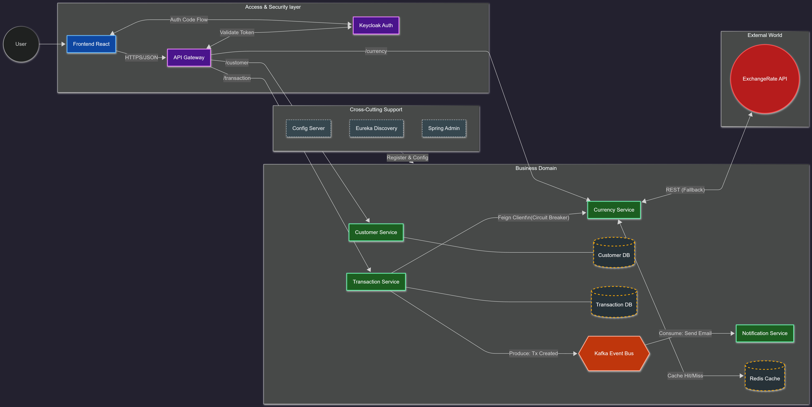

# PaymentChain


---

## About the Project

**PaymentChain** is a full-stack Fintech simulation designed to showcase modern software architecture and engineering best practices. The project demonstrates:

- Layered Microservices Architecture (Presentation, Service, Domain, Infrastructure)
- Event-Driven Microservices with Apache Kafka
- Robust Security with OAuth2/OIDC (Keycloak)
- Centralized Configuration and Service Discovery
- Asynchronous communication and scalable infrastructure
- Full integration and unit testing with Testcontainers
- Distributed caching with Redis for currency data
- Monitoring and management with Spring Boot Admin
- API documentation and testing with Swagger/OpenAPI

This repository is tailored for technical evaluators and recruiters to easily clone, run, and explore a real-world microservices solution.

---

## Architecture Overview

The solution is based on a layered microservices architecture:

- **Presentation Layer:** REST controllers in each microservice expose HTTP APIs and handle request/response mapping.
- **Service Layer:** Business logic and orchestration, including validation, error handling, and integration with other services.
- **Domain Layer:** JPA entities and domain models representing business concepts.
- **Infrastructure Layer:** Spring Data JPA repositories, Kafka integration, Redis caching, email (MailHog), monitoring (Spring Boot Admin), and external service clients.
- **API Gateway:** Central entry point for all frontend and backend requests, handling routing, security, and CORS.
- **Service Discovery & Config:** Eureka for service registry, Config Server for centralized configuration.
- **Security:** Keycloak for authentication and authorization (OIDC/OAuth2).
- **Frontend:** React (Vite) with OIDC authentication, consuming backend APIs via the API Gateway.

---

## Architecture Diagram

> 

### Main Components

- **Frontend:** React (Vite) with OIDC/OAuth2 authentication using `react-oidc-context`.
- **Backend Microservices (Java 21, Spring Boot 3):**
    - `api-gateway`: Spring Cloud Gateway (single entry point)
    - `discovery-server`: Eureka (service registry)
    - `config-server`: Centralized configuration
    - `transaction-service`: Business logic, PostgreSQL, integration tests with Testcontainers
    - `notification-service`: Kafka consumer, email notifications via MailHog
    - `currency-exchange`: Currency rates microservice, uses Redis for caching currency data
    - `springboot-admin`: Monitoring and management dashboard for all microservices
- **Infrastructure (Docker Compose):** PostgreSQL, Kafka, Zookeeper, Keycloak, MailHog, Zipkin, Redis, Spring Boot Admin

---

## API Documentation (Swagger)

- **Swagger UI:**
    - Access the API documentation and test endpoints at [http://localhost:8080/swagger-ui.html](http://localhost:8080/swagger-ui.html) (via API Gateway)
    - Each microservice exposes its own OpenAPI documentation, aggregated in the gateway
    - Endpoints are fully documented with request/response models, error codes, and security requirements

### How to Authorize in Swagger

To test secured endpoints, you need to obtain an access token from Keycloak and use the "Authorize" button in Swagger UI:

1. **Obtain Access Token:**
    - Use Postman or curl to request a token:
    ```bash
    curl -X POST "http://localhost:8180/realms/paymentchain-realm/protocol/openid-connect/token" \
      -d "client_id=api-gateway-client" \
      -d "client_secret=esIljXaYGkUK8zBZH2lI9FS8iiSYLPKL" \
      -d "username=testuser" \
      -d "password=12345" \
      -d "grant_type=password"
    ```
    - Copy the value of `access_token` from the response.
2. **Authorize in Swagger:**
    - Click the "Authorize" button in Swagger UI
    - Paste the token in the `Bearer` field
    - Now you can execute secured endpoints directly from Swagger

---

## Getting Started

### 1. Build the Backend

Before starting the infrastructure, build all Java microservices to generate the JAR files:

```bash
cd paymentchainparent
mvn clean package -DskipTests
```

### 2. Backend & Infrastructure

```bash
cd infraestructuradomain/docker
# Start all services (PostgreSQL, Kafka, Keycloak, MailHog, Eureka, Redis, Spring Boot Admin, etc.)
docker-compose up -d
```

- **Eureka Dashboard:** [http://localhost:8761](http://localhost:8761)
- **MailHog (Email Testing):** [http://localhost:8025](http://localhost:8025)
- **Keycloak:** [http://localhost:8180](http://localhost:8180)
- **Redis:** [http://localhost:6379](http://localhost:6379) (default port)
- **Spring Boot Admin:** [http://localhost:8081](http://localhost:8081)

### 3. Frontend

Before starting the frontend, copy the `.env.example` file to `.env` in the `frontend` folder and adjust any environment variables if necessary. For example (PowerShell):

```powershell
cd frontend
copy .env.example .env
```

```bash
cd frontend
npm install
npm run dev
```

- The frontend will be available at [http://localhost:3000](http://localhost:3000)
- Login will redirect to Keycloak for authentication

---

## Access & Credentials

- **Demo User:**
    - Username: `testuser`
    - Password: `12345`
- **Authentication:**
    - Login is performed via the frontend, which redirects to Keycloak (OIDC/OAuth2 PKCE flow)
    - After login, all API requests are authorized with Bearer tokens
- **MailHog:**
    - Access email notifications at [http://localhost:8025](http://localhost:8025)
- **Eureka:**
    - Service registry dashboard at [http://localhost:8761](http://localhost:8761)
- **Redis:**
    - Currency cache available at [localhost:6379](http://localhost:6379)
- **Spring Boot Admin:**
    - Microservices monitoring dashboard at [http://localhost:8081](http://localhost:8081)

---

## Testing

- **Backend:**
    - Run all unit and integration tests:
    ```bash
    mvn test
    ```
    - Integration tests use **Testcontainers** for ephemeral PostgreSQL, Kafka, and Redis instances
    - Coverage includes business logic, event publishing, REST endpoints, cache operations, and monitoring endpoints

---

## Key Technologies

- **Java 21**, **Spring Boot 3**, **Spring Cloud**
- **React**, **Vite**, **TailwindCSS** (or Material UI)
- **Docker & Docker Compose**
- **Apache Kafka** (Event-Driven Architecture)
- **Keycloak** (Security/IAM)
- **Redis** (Distributed Caching)
- **Spring Boot Admin** (Microservices Monitoring)
- **Testcontainers & JUnit 5** (Integration Testing)

---

## Best Practices

- Layered Microservices Architecture
- Asynchronous communication via Kafka
- Centralized configuration and service discovery
- Robust security with OAuth2/OIDC
- Distributed caching with Redis
- Microservices monitoring with Spring Boot Admin
- Automated integration testing
